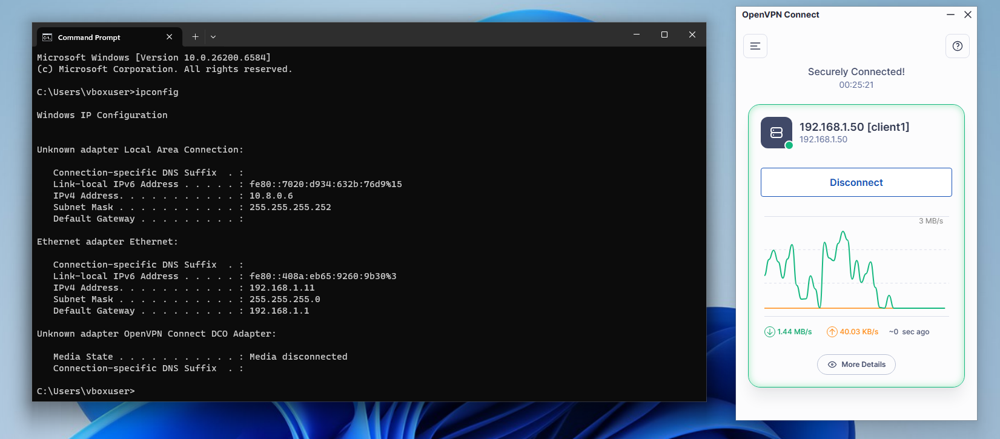
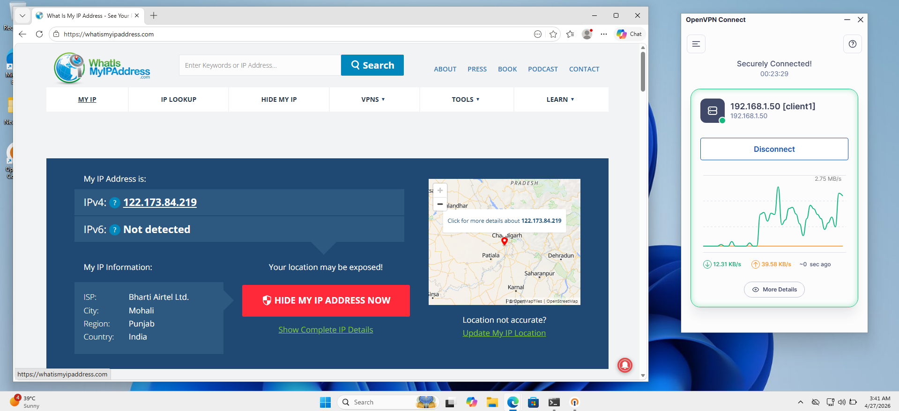
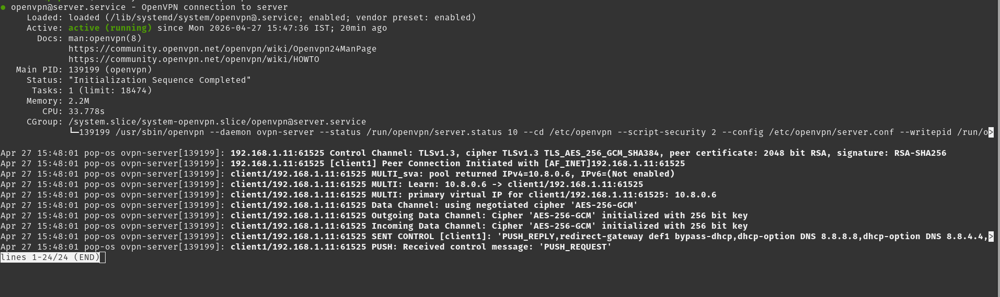

# 🔐 OpenVPN Server Setup — Built From Scratch on Linux

> A complete Remote Access VPN Server built from scratch using OpenVPN on Pop!_OS Linux.  
> Connected Windows 11 & Android clients through an AES-256-GCM encrypted tunnel.

---

## 📋 Project Overview

This project demonstrates how to build a fully functional enterprise-grade VPN server from scratch on Linux without any cloud dependency. Every step — from generating the Certificate Authority to connecting multiple clients — was done manually to understand the complete VPN infrastructure.

---

## 🖥️ Setup Details

| Item | Details |
|------|---------|
| **VPN Server OS** | Pop!_OS Linux |
| **Server Local IP** | 192.168.1.50 |
| **VPN Client 1** | Windows 11 (VirtualBox VM) |
| **VPN Client 2** | Android Mobile |
| **VPN Protocol** | OpenVPN over TCP/UDP 1194 |
| **VPN Tunnel IP** | 10.8.0.0/24 |
| **Encryption** | AES-256-GCM (Military Grade) |
| **Security Protocol** | TLSv1.3 |
| **Certificate** | 2048-bit RSA (Easy-RSA) |
| **DNS** | 8.8.8.8 / 8.8.4.4 (Google) |
| **Network Interface** | wlp2s0 (WiFi) |

---

## ✅ Features

- ✅ Full PKI Certificate Authority using Easy-RSA
- ✅ AES-256-GCM Military Grade Encryption
- ✅ TLSv1.3 Security Protocol
- ✅ 2048-bit RSA Certificate Authentication
- ✅ Multi-client Support (Windows, Android, Linux, iOS)
- ✅ iptables NAT Routing for Internet Access
- ✅ DNS Push Configuration
- ✅ Inline .ovpn file (works on all devices)
- ✅ Complete documentation

---

## 🛠️ Tech Stack

- **OS:** Pop!_OS Linux (Ubuntu based)
- **VPN Software:** OpenVPN
- **Certificate Tool:** Easy-RSA
- **Firewall:** UFW + iptables
- **Virtualization:** VirtualBox
- **Client App:** OpenVPN Connect (Windows) / OpenVPN for Android

---

## 📁 Repository Structure

```
openvpn-server-setup/
├── README.md                  # This file
├── server.conf                # OpenVPN server configuration
├── sample-client.ovpn         # Sample client config (no private keys)
└── screenshots/
    ├── vpn-connected.png      # VPN connected + ipconfig proof
    ├── public-ip-verify.png   # Public IP verification
    └── server-logs.png        # Server logs showing AES-256-GCM
```

---

## 🚀 Installation Steps

### Step 1 — Update System
```bash
sudo apt update && sudo apt upgrade -y
```

### Step 2 — Install OpenVPN & Easy-RSA
```bash
sudo apt install openvpn easy-rsa -y
```

### Step 3 — Setup Easy-RSA Directory
```bash
make-cadir ~/openvpn-ca
cd ~/openvpn-ca
```

### Step 4 — Configure Easy-RSA Variables
```bash
nano vars
```
Edit and uncomment:
```bash
set_var EASYRSA_REQ_COUNTRY    "IN"
set_var EASYRSA_REQ_PROVINCE   "Tamil Nadu"
set_var EASYRSA_REQ_CITY       "Your City"
set_var EASYRSA_REQ_ORG        "MyVPN"
set_var EASYRSA_REQ_EMAIL      "youremail@gmail.com"
set_var EASYRSA_REQ_OU         "MyVPN"
```

### Step 5 — Build Certificate Authority
```bash
./easyrsa init-pki
./easyrsa build-ca nopass
```

### Step 6 — Generate Server Certificate
```bash
./easyrsa gen-req server nopass
./easyrsa sign-req server server
```

### Step 7 — Generate Client Certificate
```bash
./easyrsa gen-req client1 nopass
./easyrsa sign-req client client1
```

### Step 8 — Generate Diffie-Hellman Key
```bash
./easyrsa gen-dh
```

### Step 9 — Generate TLS Auth Key
```bash
sudo openvpn --genkey secret ~/openvpn-ca/pki/ta.key
```

### Step 10 — Copy Files to OpenVPN Directory
```bash
sudo cp ~/openvpn-ca/pki/ca.crt /etc/openvpn/
sudo cp ~/openvpn-ca/pki/issued/server.crt /etc/openvpn/
sudo cp ~/openvpn-ca/pki/private/server.key /etc/openvpn/
sudo cp ~/openvpn-ca/pki/dh.pem /etc/openvpn/
sudo cp ~/openvpn-ca/pki/ta.key /etc/openvpn/
```

### Step 11 — Enable IP Forwarding
```bash
sudo nano /etc/sysctl.conf
# Uncomment: net.ipv4.ip_forward=1
sudo sysctl -p
```

### Step 12 — Configure Firewall
```bash
sudo ufw allow 1194/udp
sudo ufw allow 1194/tcp
sudo ufw allow OpenSSH
sudo ufw enable
```

### Step 13 — Add iptables NAT Rules
```bash
sudo iptables -t nat -A POSTROUTING -s 10.8.0.0/24 -o wlp2s0 -j MASQUERADE
sudo iptables -A FORWARD -i tun0 -j ACCEPT
sudo iptables -A FORWARD -o tun0 -j ACCEPT
sudo apt install iptables-persistent -y
sudo netfilter-persistent save
```

### Step 14 — Start OpenVPN Server
```bash
sudo systemctl start openvpn@server
sudo systemctl enable openvpn@server
sudo systemctl status openvpn@server
```

### Step 15 — Generate Inline Client Config (Works on All Devices)
```bash
cat > ~/all-in-one-client.ovpn << EOF
client
dev tun
proto tcp
remote YOUR_SERVER_IP 1194
resolv-retry infinite
nobind
persist-key
persist-tun
cipher AES-256-CBC
verb 3
key-direction 1
<ca>
$(cat ~/openvpn-ca/pki/ca.crt)
</ca>
<cert>
$(cat ~/openvpn-ca/pki/issued/client1.crt)
</cert>
<key>
$(cat ~/openvpn-ca/pki/private/client1.key)
</key>
<tls-auth>
$(sudo cat /etc/openvpn/ta.key)
</tls-auth>
EOF
```

---

## ✅ Verification

```bash
# Check server status
sudo systemctl status openvpn@server

# Check connected clients
sudo cat /etc/openvpn/openvpn-status.log

# Check VPN interface
ip a show tun0
```

On client (Windows CMD):
```cmd
ipconfig
# Look for TAP adapter with IP 10.8.0.x

ping 10.8.0.1
# Should get reply from VPN server
```

---

## 📸 Screenshots

### VPN Connected + IP Config


### Public IP Verification


### Server Logs (AES-256-GCM)


---

## 🔐 Security Notes

> ⚠️ **NEVER upload private keys to GitHub!**

| File | Upload? |
|------|---------|
| `ca.crt` | ✅ Safe |
| `server.conf` | ✅ Safe |
| `ca.key` | ❌ NEVER |
| `server.key` | ❌ NEVER |
| `client1.key` | ❌ NEVER |
| `ta.key` | ❌ NEVER |

---

## 🏆 Results Achieved

| Test | Result |
|------|--------|
| VPN Status | ✅ Securely Connected |
| VPN Client IP | 10.8.0.6 |
| Encryption | AES-256-GCM |
| Security | TLSv1.3 |
| Certificate | 2048-bit RSA |
| Public IP Match | ✅ Verified |
| Internet via VPN | ✅ Working |
| Windows 11 Client | ✅ Connected |
| Android Client | ✅ Connected |

---

## 👨‍💻 Author

**Prabhu R**
IT Support Engineer | Linux & Networking Enthusiast

[](https://linkedin.com/in/yourprofile)
[](https://github.com/yourusername)

---

## 📄 License

This project is open source and available under the [MIT License](LICENSE).
